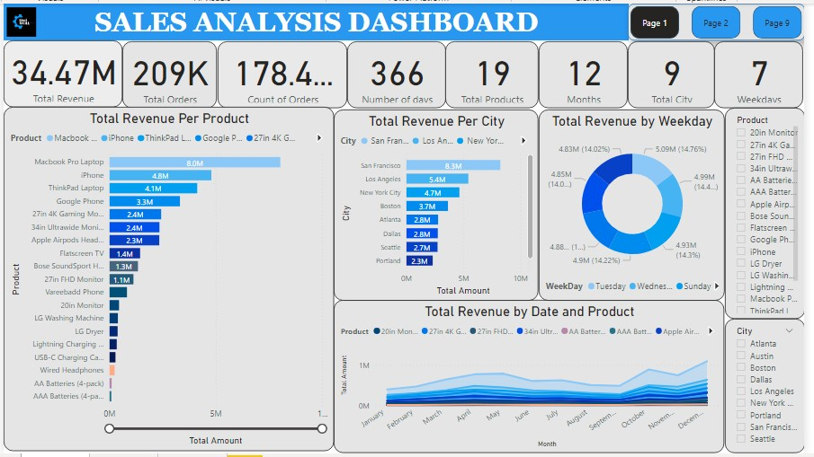

# Data Sales Analysis Project

## Project Overview

This project involves the analysis of a real dataset consisting of over 180,000 rows of sales data. The primary objective is to apply analytical skills and tools to uncover trends, assess product performance, and evaluate revenue metrics. The project follows a structured workflow encompassing data extraction, transformation, loading, data modeling, visualization, dashboard creation, and report generation.

## Aim

The primary goal of this project is to gain a comprehensive understanding of the data, analyze it, and present the findings using visualizations.

## Project Workflow and Methodology

1. **Data Extraction**: Gathered and consolidated sales data from various sources, ensuring data quality and consistency.

2. **Data Transformation**: Cleaned and preprocessed the data, addressing issues like duplicates, missing values, outliers, and standardizing formats.

3. **Data Loading**: Loaded the transformed data into SQL databases, ensuring efficient storage and retrieval for analysis.

4. **Dashboard Development**: Created interactive dashboards in Power BI, incorporating key sales metrics, visualizations, and filters for in-depth exploration.

5. **Data Analysis**: Conducted a comprehensive analysis using SQL queries and Power BI functionalities to identify meaningful patterns, trends, and correlations.

6. **Insights and Recommendations**: Derived actionable insights from the analysis, highlighting areas for improvement, growth opportunities, and potential strategies for sales optimization.

7. **Presentation and Collaboration**: Effectively communicated findings and recommendations to stakeholders through visually appealing reports and presentations, facilitating data-driven decision-making and fostering collaboration across teams.

## Tools and Technologies

- **Microsoft Excel**: Used for initial data processing and cleaning.
- **Power BI**: Leveraged for creating interactive and visually appealing dashboards.
- **Data Visualization**: Incorporated various data visualization techniques, such as charts, graphs, and heatmaps.

## Key Insights, Trends, and Patterns

- **Revenue Insights**: Total sales revenue over the examined period amounted to $34.49 million, indicating strong overall sales performance.

- **Product Insights**: The Macbook Pro Laptop, despite selling only 4,728 units, generated over $8 million in total revenue, making it one of the most popular items. This suggests that higher-priced products can generate more revenue with fewer orders, while lower-priced products yield lower revenue but more orders.

- **Orders Insight**: AAA batteries (4 pack) and AA batteries (4 pack) generated the most orders, while LG washing machine and LG dryer had the least orders. Similar to product insights, this indicates a relationship between product prices and the number of orders.

- **Monthly Trends**: Monthly revenue showed growth throughout the year, with a slight dip in August and September. December had the highest orders and revenue, while January had the lowest.

- **Quarterly Trends**: Each quarter performed well, but the fourth quarter generated the highest revenue ($11.5 million) and product orders (70,000). Quarter 1 generated the least with $6.8 million in revenue and 41,000 product orders.

- **Seasonal Trends**: Sales volume declined in January, increased from February to April, and experienced a notable drop from May to September before rising again in October, with December being the highest sales month.

- **Cities Trends**: Sales varied by city, with San Francisco, Los Angeles, and New York being the top-performing cities, while Austin, Portland, and Seattle had lower sales.

## Recommendations

1. **Bundle Deals**: Consider bundling products with lower sales alongside those with higher sales to encourage consumers to purchase them as part of a package deal.

2. **Customer Feedback**: Collect feedback from customers on products with low sales to make improvements and enhance their market appeal.

3. **Seasonal Deals**: Create promotional packages or deals for months with low sales to inspire increased purchases during those periods.

4. **Promotions and Discounts**: Offer promotions and discounts for products, months, and cities with low sales to stimulate sales growth.

## Project Assets

- PBI file : [Power BI file (PBI)](sales_data_analysis_dashboard.pbi)
- JPEG images (Visualizations) : [Dashboard](Dashboard1.jpg)
- Video presentation : [Video](vid1.mp4)

Thank you for reading. This README provides an overview of the Data Sales Analysis Project, its objectives, methodology, key insights, and recommendations. It demonstrates the use of various tools and technologies to analyze and visualize data for informed decision-making and sales optimization.
