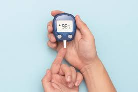

# Diabetes Analysis and Prediction Project

Welcome to my Diabetes Analysis and Prediction project! This project was completed during my internship at MeriSKILL, and it focuses on the analysis and prediction of diabetes using data analysis and machine learning techniques.

## Project Overview

**Aim**: The primary aim of this project is to leverage data analysis skills to gain insights from diabetes-related data and employ machine learning models for predictive analysis.

## Tools and Technologies

This project was carried out using the following tools and technologies:

- Python
- Pandas
- Matplotlib
- Machine Learning Libraries (e.g., Scikit-learn)

## Repository Contents

- `data/`: This folder contains the dataset used for the project.
- `notebooks/`: Jupyter notebooks used for data analysis and machine learning.

## How to Use

If you want to explore the code and findings from this project, follow these steps:

1. Clone this repository to your local machine.
2. Open the Jupyter notebooks in the `notebooks/` folder to see the code, analysis, and predictions.

## Feedback and Contributions

I welcome feedback and contributions to this project. If you have any suggestions, questions, or ideas for improvement, please don't hesitate to reach out or create a GitHub issue.

## Acknowledgments

I'd like to express my gratitude to the team at MeriSKILL for their support during this internship and the opportunity to work on this exciting project.

Thank you for checking out my Diabetes Analysis and Prediction Project! I hope you find it informative and insightful.

